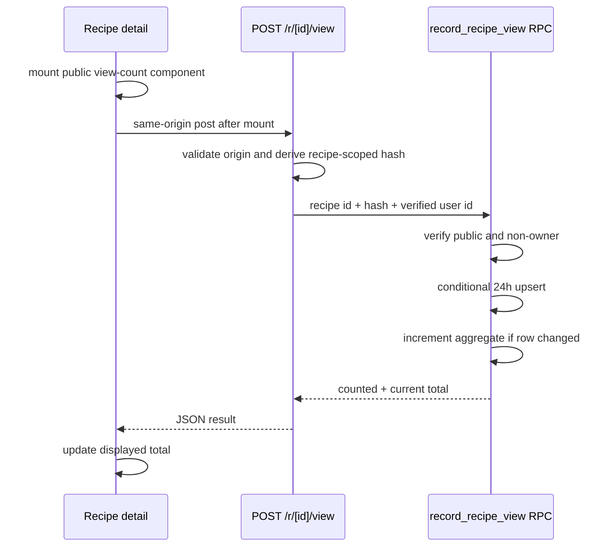

# Recipe Views - Plan

## Goal Capsule

- **Objective:** Add a privacy-friendly total view count to public recipe detail pages.
- **Authority:** The confirmed counting policy in this plan overrides the looser options in `NEXT-STEPS.md`.
- **Execution profile:** Add the database counter and cooldown primitive first, then the SvelteKit endpoint, then detail-page display and translations.
- **Stop conditions:** Do not count route preloads, private recipes, failed recipe loads, or signed-in owner views.
- **Tail ownership:** The implementation includes schema migration, generated database types, endpoint behavior, translated UI, and automated verification.

---

## Product Contract

### Summary

When a visitor opens a public recipe detail page, the app records at most one view for that browser and recipe during a rolling 24-hour period. Signed-in owners do not increase their own recipe totals. The current total appears on the detail page without introducing full analytics or storing request metadata.

### Problem Frame

Recipe authors currently cannot see whether shared recipes are being opened. Counting in the existing server `load` is unsafe because `src/app.html` enables hover-based data preloading, so a hover can execute the route without a completed page view. A dedicated post-render signal is needed to make the number useful while keeping collection minimal.

### Requirements

**Counting behavior**

- R1. Record views only for public recipes successfully rendered at `/r/[id]`.
- R2. Count a browser at most once per recipe during any rolling 24-hour period.
- R3. Exclude a signed-in recipe owner's views.
- R4. Treat anonymous and signed-in non-owner visitors consistently.
- R5. Make concurrent or repeated record requests idempotent within the cooldown window.

**Privacy and security**

- R6. Store no IP address, user-agent string, referrer, or per-request browsing event.
- R7. Identify a browser with a random HTTP-only cookie and persist only its one-way hash.
- R8. Keep dedupe records unreadable through the Data API and expose only aggregate totals.
- R9. Validate public visibility and owner exclusion inside the database operation rather than trusting client input.
- R13. Scope each stored hash to one recipe, reject malformed identifiers at the route and database boundaries, and delete dedupe rows after 30 days.

**Display**

- R10. Show the aggregate total on the recipe detail page in English, Spanish, and German.
- R11. Update the displayed total from the record response when the current open produces a new count.
- R12. A failed counting request must not prevent or replace recipe content.
- R14. Accept record requests only from the same origin and keep the mutation RPC unavailable to browser database roles.

### Actors and Key Flow

- A1. Anonymous visitor.
- A2. Signed-in non-owner visitor.
- A3. Signed-in recipe owner.

- F1. Public recipe open
  - **Trigger:** A visitor completes client rendering of a public recipe detail.
  - **Actors:** A1, A2, A3.
  - **Steps:** The page mounts its view-count component and posts to the same-origin endpoint; the endpoint reads the pre-provisioned anonymous browser token, derives a recipe-scoped hash, resolves the signed-in user, and calls the server-only atomic database operation; the operation checks visibility, ownership, and cooldown; the endpoint returns the current aggregate.
  - **Outcome:** A1 and A2 increment at most once per 24 hours; A3 receives the unchanged total.
  - **Covered by:** R1-R14.

### Acceptance Examples

- AE1. Given an anonymous browser that has not opened a public recipe in the prior 24 hours, when the detail finishes rendering, then the total increases by one and the UI shows the new total.
- AE2. Given the same browser and recipe within 24 hours, when the page is reopened or its data is invalidated, then the total does not increase.
- AE3. Given a signed-in owner, when their public recipe renders, then the total remains unchanged.
- AE4. Given a hover preload without navigation, when the server load runs but the page does not render, then no view is recorded.
- AE5. Given a private or nonexistent recipe ID, when the endpoint is called directly, then no view or dedupe row is created.
- AE6. Given two concurrent first-view requests from one browser, when both reach the database, then only one increment occurs.
- AE7. Given the counting endpoint is unavailable, when the public recipe renders, then the recipe remains usable and its initial total remains visible.
- AE8. Given a cross-origin POST or direct browser-role RPC call, when it attempts to record a view, then it is rejected without setting an identity cookie or changing data.
- AE9. Given a malformed recipe ID or hash, when it reaches either validation boundary, then no write occurs and no internal value is disclosed.

### Success Criteria

- Hovering a recipe link never changes its view count.
- Normal anonymous and non-owner opens follow the 24-hour cooldown.
- No raw visitor or request metadata is queryable from public tables.
- Detail-page loading remains streamed and navigation remains immediate.

### Scope Boundaries

Included: aggregate lifetime totals on public recipe details, browser-level 24-hour deduplication, owner exclusion, recipe-scoped pseudonyms with 30-day retention, translations, and supporting tests.

Deferred: showing totals on recipe cards, author dashboards, time-series analytics, unique-user reporting, bot classification, distributed rate limiting beyond same-origin and server-only RPC controls, and historical backfill.

This is an informal engagement signal, not an abuse-proof analytics system. Browser automation can still create many identities and complete real page opens; stronger bot and distributed rate controls are deferred until product usage warrants them.

### Source

- `NEXT-STEPS.md:5-12`

---

## Planning Contract

### Key Technical Decisions

- KTD1. Send the record request from the rendered detail component, not `+page.server.ts`. SvelteKit load functions can run for hover preloads and rerun after invalidation, while a browser-side effect runs only after mount; server-side cooldown enforcement still makes effect reruns harmless.
- KTD2. Use one random, HTTP-only, same-site browser cookie and derive a recipe-scoped hash before database use. The route's synchronous load path provisions the cookie before returning streamed recipe work, so concurrent post-render requests share one identity without delaying navigation; hover preload may establish identity but cannot record a view.
- KTD3. Enforce an exact rolling 24-hour cooldown with one dedupe row per recipe and browser hash. An atomic conditional upsert updates `last_counted_at` only after the cooldown and prevents concurrent double increments.
- KTD4. Keep dedupe storage and privileged mutation logic in the unexposed `private` schema. Expose a narrow `public` security-invoker wrapper only to the server role, deny browser roles direct execution, restrict the private schema/function privilege chain to that role, enable RLS on aggregate storage, and grant aggregate reads only. This follows the repository's rating privilege discipline without placing a security-definer function in an exposed schema.
- KTD5. Return `{ counted, viewCount }` from the endpoint. The page starts with the streamed aggregate and replaces it with the endpoint's authoritative total only when the request succeeds.
- KTD6. Apply the user-selected policy of one view per browser and recipe per 24 hours while excluding owner views. (session-settled: user-directed — chosen over counting every open or signed-in visitors only: it reduces noisy repeats without collecting full analytics.)
- KTD7. Use a server-only Supabase secret client for the wrapper and pass the user ID established by `locals.supabase.auth.getUser()`. This closes the direct-RPC arbitrary-hash bypass; the secret client and raw browser token remain in server-only modules and never enter serialized page data.
- KTD8. Retain dedupe rows for 30 days and remove them with a daily Supabase Cron job. The 24-hour gate remains exact because it uses database time; retention only bounds pseudonymous history and storage growth.

### High-Level Technical Design

### Data Model

- `private.recipe_view_dedupe`: composite primary key `(recipe_id, viewer_hash)`, fixed-size recipe-scoped hash, non-null `last_counted_at`, cascading recipe deletion, an expiry index, and no browser-role schema or table access.
- `public.recipe_view_stats`: one row per recipe with a nonnegative `bigint` `view_count` and `updated_at`, cascading recipe deletion, RLS enabled, and a select policy that follows recipe visibility.
- `private.record_recipe_view(...)`: security-definer mutation with an empty search path, explicit table qualification, recipe visibility/owner checks, recipe-row lock, conditional upsert, aggregate increment, and restricted execute grants.
- `public.record_recipe_view(...)`: security-invoker wrapper executable only by the server role. A hidden or missing recipe returns no row; owner and cooldown no-ops return `counted: false` with the current total.
- The wrapper call is one database transaction. Lock order is recipe row, dedupe row, then aggregate row so a concurrent privacy change or deletion cannot interleave between authorization and increment.

### Cookie Contract

- Use one opaque random token with a non-identifying name such as `recipe_viewer`.
- Set `httpOnly`, `sameSite: 'lax'`, `path: '/'`, a long but finite `maxAge`, and `secure` outside development.
- Provision the cookie synchronously in the recipe server load before returning the streamed promise. The record endpoint requires the cookie rather than creating competing identities.
- Hash the token together with the validated recipe ID using SHA-256 before invoking the database; never log or return the token or hash.
- Cookie loss creates a new browser identity and can produce another count. This is acceptable for the initial privacy-first counter.

### Error and Performance Behavior

- The endpoint rejects a missing/mismatched `Origin`, malformed UUID, or missing viewer cookie before invoking the database.
- The endpoint returns the same not-found response for private and missing recipes without revealing which condition applied.
- Owner and cooldown no-ops return success with `counted: false` and the current total.
- The page treats endpoint and parsing failures as non-blocking. If the initial aggregate read fails, it omits the total rather than displaying a false zero; a later successful record response restores the authoritative total.
- The existing streamed recipe promise remains intact. Aggregate lookup joins the recipe-detail promise and does not move work in front of the streamed shell.
- The dedupe composite primary key supports the conflict path; the aggregate primary key supports constant-time detail lookup.
- Application code and database errors omit tokens, hashes, RPC arguments, and database messages. Platform-level request telemetry may retain network metadata under the provider's own policy and is not represented as app-managed analytics.
- The endpoint response is cache-disabled. Removing its mounted component or disabling the route stops new recording without affecting recipe rendering or aggregate reads.

### System-Wide Impact and Risks

- The server-only Supabase secret adds a deployment credential. Configuration must fail closed for recording while recipe rendering continues, and the secret must never use a public environment-variable prefix.
- Schema should deploy before application code and the secret should exist before recording is enabled. Missing tables, wrapper, or secret must degrade to the initial displayed total rather than reject the recipe load.
- The Cron job needs a stable unique name and must be unscheduled before its function/table is dropped during rollback. Do not drop the shared `pg_cron` extension during rollback because other features may use it later.
- The feature starts totals at zero on deployment and performs no backfill. Removing the feature may discard only view-specific aggregate and pseudonymous data; it must not mutate recipe rows.
- Row locking protects the public-visibility check but adds a short conflict with recipe edits. Keep the recording transaction narrow and verify it does not materially delay normal updates.

### Sequencing

U1 establishes the database contract consumed by U2. Provision the server secret, then deploy U2. U3 completes the visible behavior and generated localization output after the endpoint is available.

---

## Implementation Units

### U1. Atomic database counter and generated types

- **Goal:** Create private deduplication and public aggregate storage with one atomic recording operation.
- **Requirements:** R2-R9.
- **Files:**
  - `supabase/migrations/<generated_timestamp>_add_recipe_views.sql`
  - `supabase/tests/recipe_views.test.sql`
  - `src/lib/database.types.ts`
- **Patterns:** Follow `supabase/migrations/20260722190000_add_recipe_ratings.sql` for private security-definer logic, aggregate tables, RLS, grants, and cascading cleanup. Create the migration with `supabase migration new add_recipe_views`, use the available `pgtap` extension for SQL behavior tests, and regenerate TypeScript types rather than hand-maintaining the final shape.
- **Approach:** Add the private dedupe table, public aggregate table, private/public function pair, and daily 30-day cleanup job described in the Planning Contract. Capture database time once per call. Lock and validate the recipe before using `INSERT ... ON CONFLICT ... DO UPDATE ... WHERE last_counted_at <= captured_time - interval '24 hours' RETURNING` as the concurrency gate, then increment aggregate stats in the same transaction only when that statement returns a changed row.
- **Test scenarios:**
  1. First anonymous hash on a public recipe returns `counted: true` and total 1.
  2. The same hash within 24 hours returns `counted: false` without changing the total.
  3. Just before 24 hours is blocked; exactly at and just after 24 hours permit exactly one new count; future timestamps remain blocked.
  4. Two concurrent calls for the same new hash produce one increment.
  5. A signed-in owner receives no increment.
  6. A private or missing recipe receives no increment and no dedupe row.
  7. Direct `anon` and `authenticated` wrapper execution is denied; the server role succeeds; direct private schema/function/table access remains denied outside its intended privilege chain.
  8. Recipe deletion cascades to both view tables.
  9. A concurrent privacy toggle or deletion cannot commit between recipe validation and increment.
  10. An induced aggregate-write failure rolls back the dedupe timestamp and total together.
  11. Invalid UUIDs, wrong-length hashes, null timestamps, and negative totals are rejected without partial writes.
  12. The retention job deletes dedupe rows older than 30 days without changing aggregate totals.
- **Verification:** Apply against local Supabase, run `supabase/tests/recipe_views.test.sql`, inspect function owners/search paths/schema usage/execute grants/RLS, verify the Cron job, and confirm generated public `Functions` and table types compile.
- **Rollback:** Unschedule the named cleanup job, revoke/drop the wrapper and private function, then drop view-specific tables without dropping shared extensions or changing recipe rows.

### U2. Post-render view endpoint and server helper

- **Goal:** Convert a rendered recipe open into a privacy-safe, fault-isolated RPC call.
- **Requirements:** R1-R9, R11-R12.
- **Files:**
  - `src/lib/server/recipeViews.ts`
  - `src/lib/server/recipeViews.test.ts`
  - `src/lib/server/supabaseAdmin.ts`
  - `src/routes/r/[id]/view/+server.ts`
  - `src/lib/server/recipeViewEndpoint.test.ts`
  - `.env.example`
- **Patterns:** Follow the typed `RequestHandler` shape in `src/routes/auth/logout/+server.ts` and use `event.locals.supabase` from `src/hooks.server.ts`.
- **Approach:** Keep cookie provisioning, UUID validation, recipe-scoped hashing, secret-client construction, and RPC result normalization in server-only modules. The POST handler requires a same-origin request and existing cookie, accepts no visitor-controlled body, resolves the user with the request-scoped client, invokes the server-only wrapper, maps absent rows to the common not-found response, and returns cache-disabled JSON containing the authoritative result.
- **Test scenarios:**
  1. An existing cookie is reused and never exposed in the response.
  2. Server load provision creates a cryptographically random token with the required flags; the endpoint rejects a missing cookie without creating one.
  3. Hash output is deterministic for one token and recipe, differs across tokens, and differs across recipes for the same token.
  4. Public non-owner RPC success maps to `{ counted, viewCount }`.
  5. Owner/cooldown no-op remains a successful response.
  6. Missing/private and database-error paths return safe responses without leaking database messages.
  7. The endpoint ignores request bodies and cannot accept a caller-supplied visitor hash or user ID.
  8. Cross-origin POST/fetch, malformed UUID, and missing-cookie requests produce no writes.
  9. No server secret, raw token, hash, or RPC argument appears in serialized data, responses, or representative application logs.
- **Verification:** Run the two Vitest files and exercise the endpoint locally as anonymous, owner, and non-owner.

### U3. Detail-page count, post-render signal, and localization

- **Goal:** Display the total and record a view only after the public recipe has rendered.
- **Requirements:** R1, R3-R4, R10-R12.
- **Files:**
  - `src/routes/r/[id]/+page.server.ts`
  - `src/routes/r/[id]/+page.svelte`
  - `src/lib/components/RecipeViewCount.svelte`
  - `messages/en.json`
  - `messages/es.json`
  - `messages/de.json`
  - `src/lib/paraglide/messages.js`
  - `src/lib/paraglide/messages.d.ts`
  - `src/lib/paraglide/messages/*`
- **Patterns:** Preserve the streamed promise and matching skeleton in the existing route. Follow the rating aggregate lookup and Paraglide message-generation workflow already used by the detail page.
- **Approach:** Provision the identity cookie synchronously before returning the existing recipe promise. Load the aggregate total with that promise, defaulting missing stats to zero. Render a keyed `RecipeViewCount` only inside the resolved public-recipe block; its post-mount effect records the view, owns local display state, and replaces the initial count only from a successful response. Regenerate Paraglide artifacts from source messages.
- **Test scenarios:**
  1. Public detail initially renders the database total, including zero.
  2. A successful new count updates the visible number without reloading the recipe.
  3. A cooldown or owner no-op leaves the authoritative returned total visible.
  4. A rejected POST leaves recipe content and the initial total intact.
  5. A hover preload runs only the server load and never posts a view.
  6. Changing to a different recipe records that recipe once; rating form invalidation does not double-count.
  7. English, Spanish, and German render the count message correctly.
- **Verification:** Run `pnpm check`, validate the component with the Svelte autofixer, and manually exercise preload, anonymous, owner, non-owner, failure, and responsive detail-page states.

---

## Verification Contract

- `pnpm test` must pass all existing and new unit tests.
- `pnpm check` must report no Svelte or TypeScript errors.
- `pnpm lint` must pass after generated Paraglide output and new files are formatted.
- Local Supabase verification must prove cooldown boundaries, concurrency, rollback atomicity, privilege grants, owner exclusion, privacy-toggle serialization, retention, and cascade behavior from U1.
- Browser verification must prove that hover preloading only provisions identity, completed rendering increments, repeat opens inside 24 hours do not increment, owner opens do not increment, cross-origin requests are rejected, and endpoint failure does not disrupt recipe content.
- Inspect the final schema with Supabase advisors and resolve security or performance findings introduced by the migration.
- Verify production configuration supplies the server-only Supabase secret without exposing it to public environment variables, browser bundles, serialized load data, or logs.

---

## Definition of Done

- R1-R14 and AE1-AE9 are demonstrably satisfied.
- The database operation is atomic under concurrent requests.
- Dedupe data is inaccessible through direct Data API table reads.
- Application-managed storage and logs contain no IP address, user agent, referrer, raw cookie token, hash, RPC argument, or per-request event history; provider telemetry is documented separately.
- Dedupe identifiers are recipe-scoped and removed after 30 days without changing aggregate totals.
- Public detail navigation preserves the existing instant shell and streamed recipe content.
- View totals are translated and visible only on recipe detail pages.
- Generated database and Paraglide artifacts match their source schema/messages.
- Tests, checks, lint, SQL verification, and browser scenarios in the Verification Contract pass.
- No abandoned experiments, unused helpers, or unrelated card/dashboard analytics remain in the diff.
